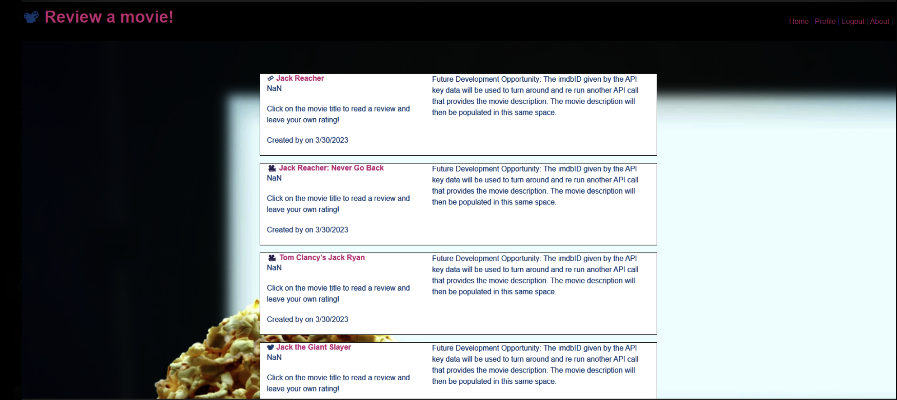
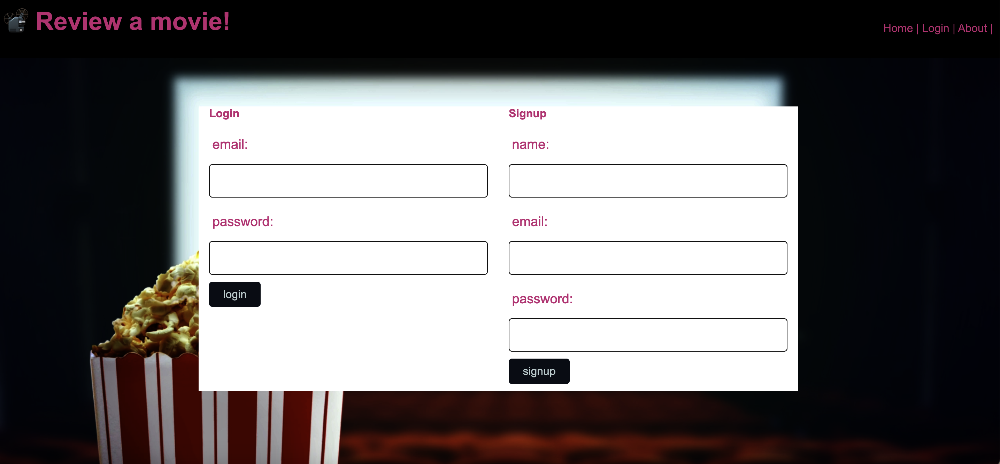

# Project #2 - Movie Reviews

## Description
This is a real world full stack application that uses node.js and express.js to create a restful API and uses handlebars.js as the templating engine. MySQL and Sequelize ORM are used for database. We utilize GET and POST routs to retrieve and add new data.
 
## Table of contents
  - [Installation](#installation)
  - [Usage](#usage)
  - [Contributions](#contributions)
  - [Tests](#tests)
  - [License](#license)
  - [Questions](#questions)
  
## Installation
This is a fully deployed application hosted on Heroku. No installation needed. Simply visit the application at the deployed URL.

## Usage
Someone can use this application by searching the data base of movies and leaving reviews of it, or they can look up a movie that they want to watch to read reviews before they spend the time to watch it. 

here is a great place for you to upload screen shots or even a screen record of your application.  But remember to delete this line of text first

---------------------------------------------------------------------------------------------------------------------------------------------------
## Contributions 
[Sara Schroeder](https://github.com/saraschroeder);
[Jonah Kane](https://github.com/jonahkane);
[Abigail Personius](https://github.com/apersonius);
[Huda Yusuf](https://github.com/hyusuff)

## Tests 
npm run tests can be used if the application is being accessed locally from a CLI
## License 
MIT License

(https://opensource.org/licenses/MIT)

A short and simple permissive license with conditions only requiring preservation of copyright and license notices. Licensed works, modifications, and larger works may be distributed under different terms and without source code.

## Questions
If you have questions on this project you can find me on Github at [Sara Schroeder](https://github.com/saraschroeder);
[Jonah Kane](https://github.com/jonahkane);
[Abigail Personius](https://github.com/apersonius);
[Huda Yusuf](https://github.com/hyusuff)

or please feel free to email one of us at: sara.schroeder00@gmail.com, jonahtkane@gmail.com, personius12@gmail.com, hudayusuf@gmail.com